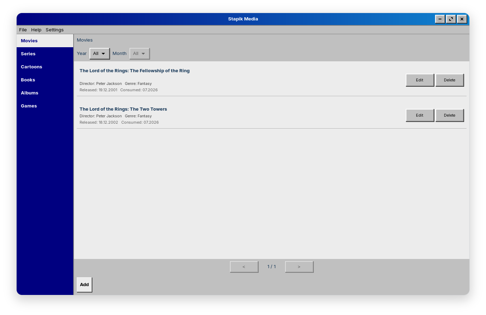
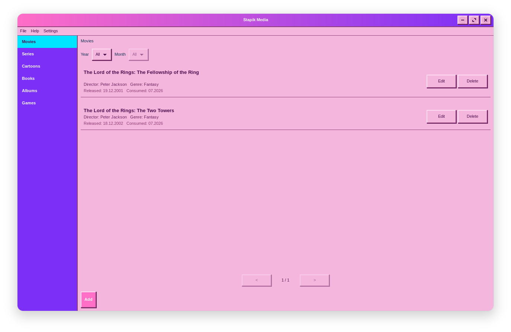
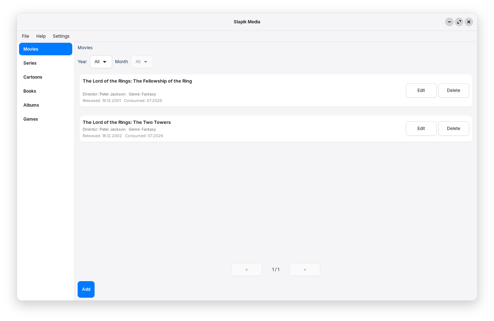

# Stapik Media

A desktop media-tracking application for Linux, written in C++20 using GTK4/gtkmm. Styled after the retro old-school aesthetic.



## Features

- **Category sidebar** - browse your entries by type: Movies, Series, Cartoons, Books, Albums, Games.
- **Media entries** - add, edit and delete entries, with fields tailored to each category (director/genre for movies and series, author/genre/audiobook for books, performer/publisher/genre for albums, studio/publisher/platform for games).
- **Release date with adjustable precision** - store a full date, a month and year, or just a year, depending on how much you actually know about older titles.
- **Consumption date** - track the month and year you watched/read/listened/played each entry, defaulting to the current month and year when adding a new one
- **Filtering** - narrow the list down by consumption year, and optionally by month within that year.
- **Pagination** - entries are shown 20 per page.
- **Cloud sync** - save and load data via an external API (compatible with a self-hosted server), with automatic conflict resolution based on timestamps.
- **Multilingual UI** - Polish, English and German interface with instant switching.
- **Auto-save** - data saved locally after every change.
- **Retro aesthetic** — classic look with raised buttons, blue navigation bar and grey cells.
- **Three themes** - Classic, Modern and Classic Pink, switchable live from the menu.

## Dependencies

- `gtkmm-4.0`
- `libcurl`
- [`stapik-common`](https://github.com/stapik/stapik-common) (fetched automatically via CMake FetchContent)
- `nlohmann/json` (fetched automatically via CMake FetchContent, transitively provided by `stapik-common`)

On Ubuntu/Debian:
```bash
sudo apt install libgtkmm-4.0-dev libcurl4-openssl-dev
```

Building a `.deb` package additionally requires `dpkg-dev` (used to auto-detect runtime dependencies):
```bash
sudo apt install dpkg-dev
```

## Building

```bash
git clone https://github.com/Stapik-Group/stapik-media
cd stapik-media
cmake -B cmake-build-release -DCMAKE_BUILD_TYPE=Release
cmake --build cmake-build-release
```

## Installation

### Option 1 — Download prebuilt `.deb` (recommended)

Download the latest `.deb` package from the [Releases page](https://github.com/Stapik-Group/stapik-media/releases), then install it:

```bash
sudo dpkg -i stapikmedia_*.deb
sudo apt install -f   # resolves any missing runtime dependencies
```

### Option 2 — build `.deb` from source

If you'd rather build the package yourself:

```bash
cd cmake-build-release
cpack -G DEB
sudo dpkg -i stapikmedia_*.deb
sudo apt install -f
```

Either option installs the app to `/usr/lib/stapikmedia/`, with a launcher at `/usr/bin/stapikmedia`, and it appears in the desktop environment's application menu.

### Option 3 — per-user install (no sudo required)

```bash
cmake --install cmake-build-release --prefix "$HOME/.local"
```

Installs to `~/.local/lib/stapikmedia/`, with a launcher at `~/.local/bin/stapikmedia`. Make sure `~/.local/bin` is in your `PATH`.

## Uninstalling

### If installed via `.deb`

```bash
sudo dpkg -r stapikmedia
```

### If installed per-user

```bash
rm -rf ~/.local/lib/stapikmedia
rm ~/.local/bin/stapikmedia
rm ~/.local/share/applications/stapikmedia.desktop
rm ~/.local/share/icons/hicolor/256x256/apps/stapikmedia.png
```

Either way, your media data, cloud config and language preference remain at `~/.local/share/stapikmedia/` — see [Data Storage](#data-storage) below if you want to remove those too.

## Cloud Sync

The app supports synchronization via [Stapik Cloud](https://github.com/Stapik-Group/stapik-cloud) — the same server and protocol used by Stapik Calendar. Go to **File → Connect**, enter the server URL and API key. If a connection is already configured, the app reconnects automatically on startup.

Once connected, the app compares the local file and the cloud copy using a `lastUpdate` timestamp and keeps whichever one is newer, overwriting the other **as a whole document**. There is no field-level or entry-level merging — if both copies changed since the last sync, the older one is fully replaced.

Data is saved locally after every change, and the app also attempts to push it to the cloud right away. Writes are optimistic-concurrency-checked: if another device saved a newer version in the meantime, the write is rejected, the server's copy is fetched, and the app retries once against that copy before falling back to accepting the server's version. If the cloud is unreachable at that moment, the change stays saved locally and the app quietly retries on the next save — no data is lost, but the cloud copy will lag behind until the next successful write. You can also trigger a sync manually from **File → Sync**.

**Caution for multi-device use:** since conflict resolution is whole-document, editing the schedule offline on two different machines before either one reconnects can still cause one set of changes to be discarded. Stapik Cloud keeps a version history of every write, so a discarded document isn't gone permanently, but the app itself doesn't yet expose a way to browse or restore old versions. If you use the app on more than one device, make sure to sync (or at least go online) after each editing session to avoid overwriting your own changes.

The app talks to the Stapik Cloud `/documents/{slotKey}` endpoint (slot key `planner.json`), authenticated via an `x-api-key` header. See the [Stapik Cloud API reference](https://github.com/Stapik-Group/stapik-cloud) for details.

If you're upgrading from an app version that used the older, incompatible cloud protocol, the app detects this automatically on first launch and clears the saved connection — you'll need to reconnect once via **File → Connect**.

## Data Storage

Media data is stored locally at `~/.local/share/stapikmedia/media.json`, wrapped with a `lastUpdate` timestamp used for cloud sync. Cloud config at `~/.local/share/stapikmedia/config.json`. Language preference at `~/.local/share/stapikmedia/locale.txt`.

## Themes

Switch between three themes from **Settings → Theme**: Classic (the original retro look), Modern (flat, minimal), and Classic Pink. The choice applies instantly and is remembered between launches.




## TODO

- [x] Category-based sidebar with per-type entry fields
- [x] Filtering by consumption year/month
- [x] Pagination
- [x] Cloud sync with conflict resolution
- [x] `.deb` package for easier distribution
- [x] Multiple themes (Classic / Modern / Classic Pink)
- [ ] Import from an existing spreadsheet (CSV/XLSX)
- [ ] Entry search by title
- [ ] Sort options (by title, release date, consumption date)
- [ ] Flatpak package